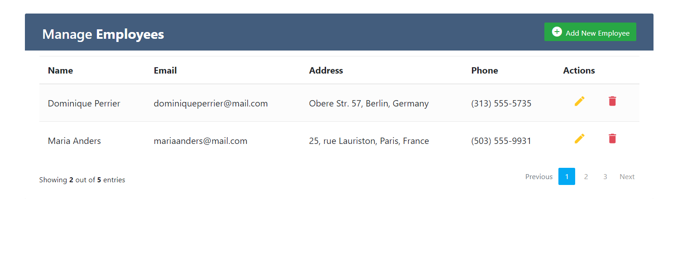
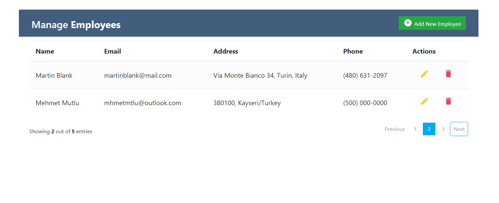
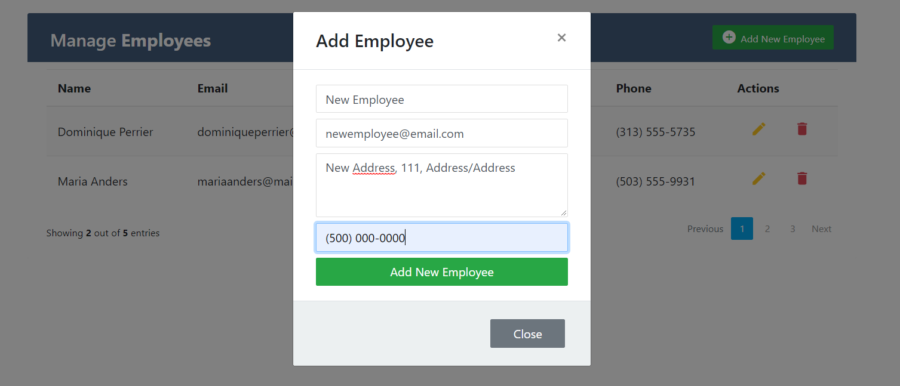
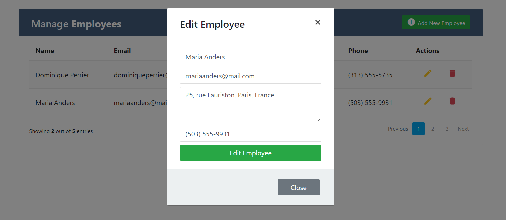

# ⚛️ CRUD Operations with ReactJS

I have coded CRUD operations with using ReactJS. In this project, I have made mainly practices with React Hooks.

# 🧰 Toolbox

<ul style="list-style-type:disc">
   <li><a href="https://reactjs.org">ReactJS</a></li>
   <li><a href="https://reactjs.org/docs/hooks-reference.html">React Hooks</a></li>
   <li><a href="https://react-bootstrap.github.io">React Bootstrap</a></li>
</ul>

# 🎞 Screenshot

